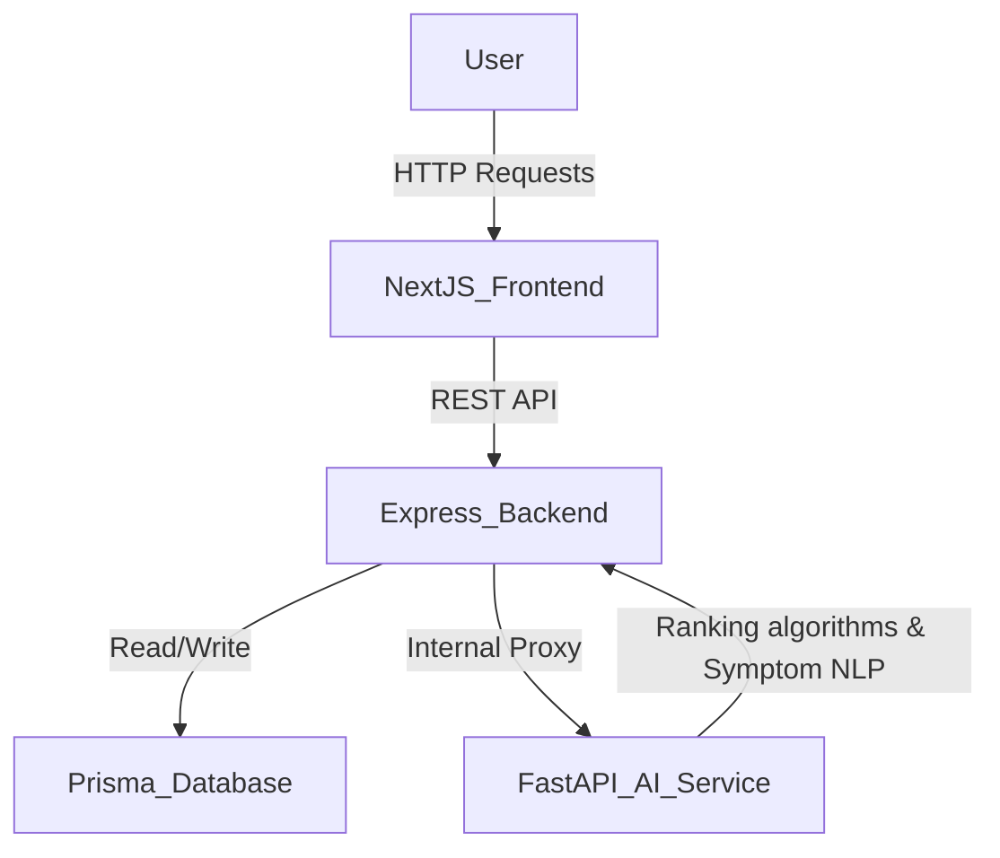

# ClearMed Architecture

ClearMed is built using a modern 3-tier microservices architecture designed to be fast, scalable, and intelligent. 

## High Level Overview

1. **Frontend (Next.js & React)**
   - Responsible for rendering the user interface cleanly and responsively.
   - Built with Next.js 14 (App Router) & TailwindCSS.
   - Communicates uniquely with the Node.js API Gateway.

2. **Backend API Gateway (Node.js & Express)**
   - Acts as the primary orchestrator for the frontend.
   - Connects to the primary PostgreSQL (or SQLite for local MVP) Database via **Prisma ORM**.
   - Handles standard business logic, file uploads (via Multer), basic OCR processing (Tesseract.js).
   - Serves as a proxy to forward heavy analytical workloads to the AI Microservice.

3. **AI Intelligence Core (Python FastAPI)**
   - An isolated microservice designed strictly for Data Science and NLP tasks.
   - Built using **FastAPI**.
   - Contains:
     - `symptom_engine.py`: Maps symptoms to condition clusters.
     - `ranking_engine.py`: A weighted algorithm matching condition treatments to Hospital Specializations.
     - `cost_engine.py`: Predicts standard treatment costs based on hospital premium multipliers.

4. **Database (Prisma / SQLite for Dev)**
   - Models include `Hospital`, `Treatment`, `Doctor`, and `Feedback`.

## System Diagram

